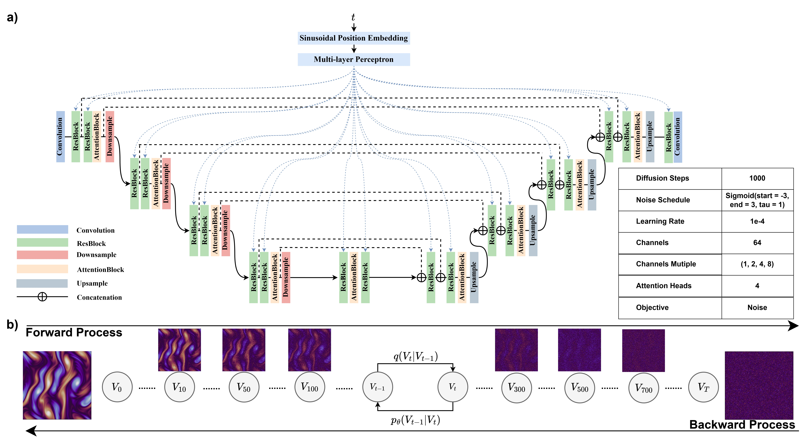
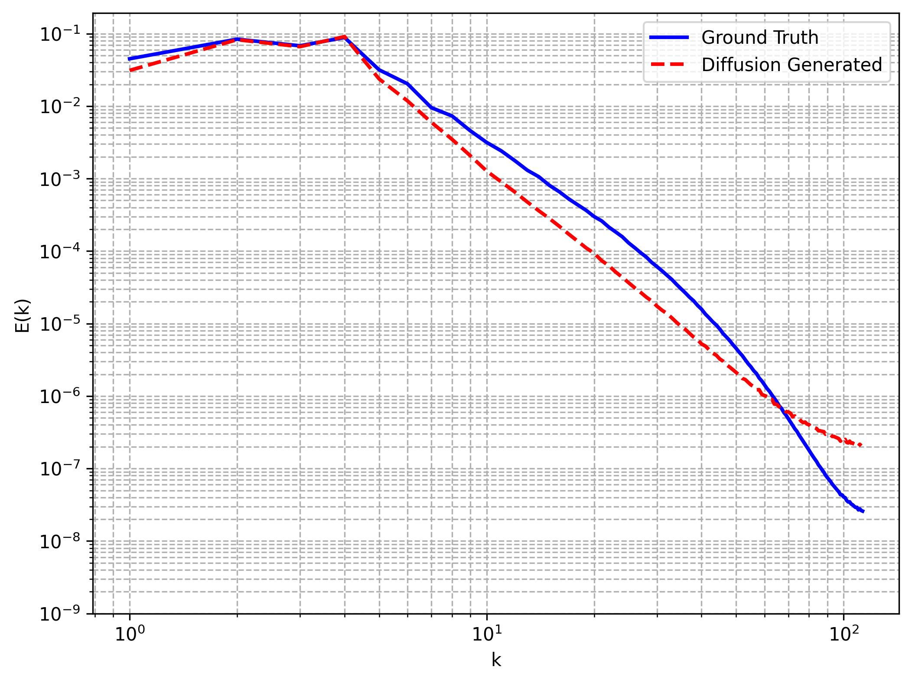
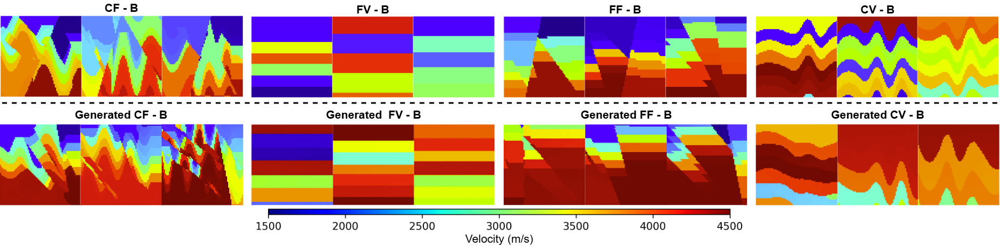
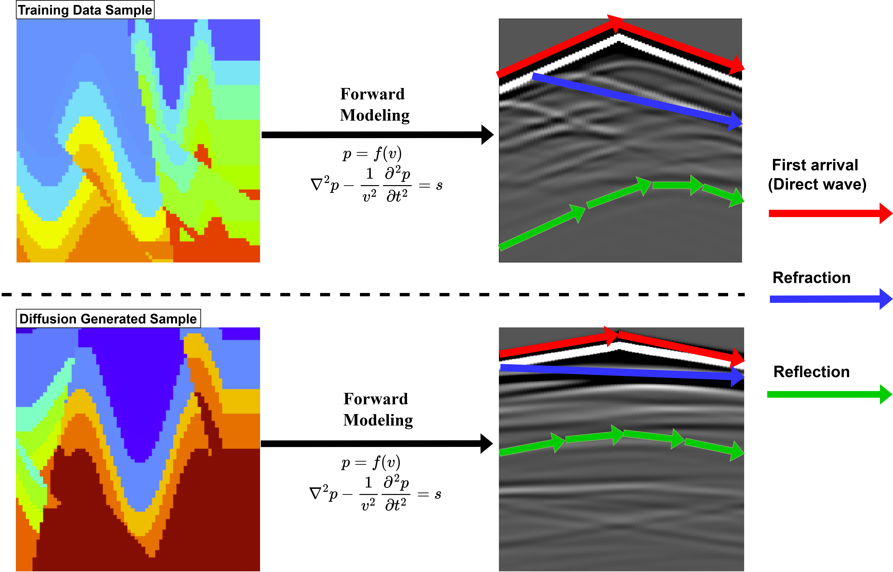

# Physical Field Generation via Diffusion Models

## Dataset and Model Weights Access

### Datasets
- **Kolmogorov Flow Dataset**: [Download Link](https://drive.google.com/file/d/1CUHSF9pUtsrEtHKd07dFuplK7RtVx6ck/view?usp=drive_link)
- **Velocity Map Dataset (Geophysics)**: Available at [OpenFWI Project](https://sites.google.com/site/youzuolin044/openfwi)

### Pre-trained Models
- **Kolmogorov Flow Model**: [Download Weights](https://drive.google.com/file/d/1RRQN71KGJS-pruVhf2kDv0e4Z8Z3ow46/view?usp=sharing)
- **Geophysics Velocity Map Model**: [Download Weights](https://drive.google.com/file/d/1n4Alx2foT0oJ5Ve-wxuBO31-3sLzw508/view?usp=sharing)

## Results Visualization

### 1. Fluid Mechanics Example: Kolmogorov Flow Generation

#### 1.1 Diffusion Process Overview

    

    <em>Progressive denoising process: From random noise to physically meaningful flow patterns. The visualization demonstrates how our diffusion model gradually constructs coherent fluid structures.</em>

#### 1.2 Flow Field Generation Results

    

    <em>Generated vorticity fields demonstrating the model's ability to capture complex flow structures and diverse pattern formations in Kolmogorov flow.</em>

#### 1.3 Flow Analysis

    

    <em>Velocity field spatial distribution analysis showing the characteristic patterns of Kolmogorov flow.</em>

#### 1.4 Physical Validation

    

    <em>Spectral analysis of the generated Kolmogorov flow fields, validating physical consistency through energy distribution across different scales.</em>

### 2. Geophysics Example: Velocity Map Generation

#### 2.1 Generated Samples

    

    <em>Sample set of generated geophysical velocity maps, showcasing the model's capability to produce diverse yet physically consistent subsurface velocity distributions.</em>

#### 2.2 Forward Prediction

    

    <em>Forward velocity prediction results for geophysical scenarios. Comparison between model predictions and reference data demonstrates the accuracy of our approach in capturing subsurface structures.</em>

